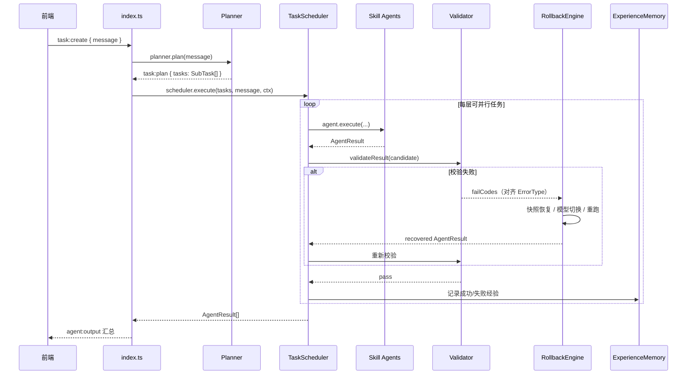
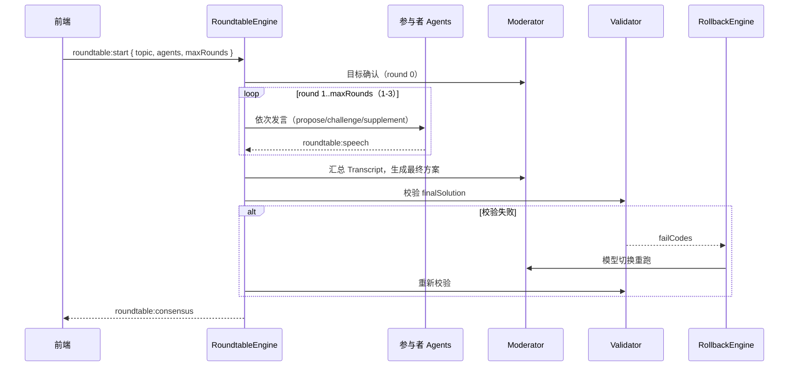

# Hermes AgentOS 架构说明

## 1. 架构目标

Hermes AgentOS 的目标不是证明“某个 Agent 很聪明”，而是证明“多 Agent 系统可以带着验证、回滚、审计和可观测性进入生产”。架构遵循三条原则：

1. **确定性工程承载智能性**：模型只负责生成候选结果，任务拆解、调度、验证、回滚由确定性系统接管。
2. **每个输出可验证、可追溯、可回滚**：从任务输入到最终工件，贯穿 Trace ID、Snapshot 和执行证据。
3. **故障自愈优先，人工介入兜底**：质检失败先自动重试与模型降级，达到阈值后进入 Human-in-the-loop。

## 2. 总体架构

```text
用户 / 前端
   │  Socket.IO / REST
   ▼
接口层  packages/server/src/index.ts
   │  Koa REST（health / stats / demo）+ Socket.IO 事件分发
   ▼
调度层  planner.ts + scheduler.ts
   │  自然语言 → SubTask DAG → 拓扑分层 → 并行批次
   ▼
执行层  Skill Agents（data/research/analyst/writer/moderator）
   │  统一 SkillAgent 运行时：上下文 → 模型选择 → LLM/Mock → Schema 校验
   ▼
治理闭环层  Validator / RollbackEngine / ExperienceMemory / SnapshotStore
   │  输出防火墙 → 失败分类 → 快照恢复/模型切换/重跑 → 经验沉淀 → 人工兜底
   ▼
共享契约层  packages/shared（AgentRole、事件协议、错误码、统计类型）
```

## 3. 模块地图

| 模块 | 路径 | 职责 |
|---|---|---|
| 服务入口 | `packages/server/src/index.ts` | Koa 路由、Socket.IO 事件绑定、活动任务去重、统计埋点 |
| Planner | `packages/server/src/planner.ts` | 规则型任务拆解，输出 `SubTask[]` 依赖图 |
| TaskScheduler | `packages/server/src/scheduler.ts` | DAG 拓扑执行、并行批次、输出防火墙、Rollback 集成 |
| SkillAgent 运行时 | `packages/server/src/agents/skill-agent.ts` | Trace/Snapshot/重试/错误分类/经验记录的统一运行时 |
| Skill 模块 | `packages/server/src/agents/*` | data/research/analyst/writer/moderator/validator/rollback |
| 圆桌引擎 | `packages/server/src/roundtable-engine.ts` | 多轮发言、Moderator 合成、最终方案质检 |
| Rollback 引擎 | `packages/server/src/rollback-engine.ts` | 快照恢复、模型切换、重跑、人工兜底 |
| Experience Memory | `packages/server/src/experience-memory.ts` | JSON 持久化成功/失败记录，影响模型选择 |
| Snapshot Store | `packages/server/src/snapshot-store.ts` | 进程内快照存取 |
| LLM/Mock 层 | `packages/server/src/llm.ts` | 模型路由、按角色模型回退链、离线 Mock 数据集 |
| Dashboard 统计 | `packages/server/src/stats.ts` | Token/成本/健康度/圆桌统计 |
| Demo 数据 | `packages/server/src/demo/new-energy.ts` | 新能源战略分析 Prompt 与预置数据 |
| 共享协议 | `packages/shared/src/types.ts`、`events.ts` | 前后端唯一契约源 |

## 4. 核心数据流

### 4.1 DAG 协作流程（`task:create`）



关键点：
- Scheduler 按依赖关系做拓扑分层，同一层任务并行执行。
- 每个 Agent 产物在进入 DAG 状态前必须通过 Validator；失败时先走 Rollback，不直接污染下游。
- 每次执行（含 Rollback 重跑）都会写入 Experience Memory。

### 4.2 AI 圆桌流程（`roundtable:start`）



### 4.3 治理闭环

```text
Agent 候选输出
   │
   ▼
Validator（四维校验）
   ├─ pass ──► 进入 DAG 状态 / 发布 consensus
   └─ fail ──► failCodes（DATA / MODEL / TOOL / POLICY）
                  │
                  ▼
          RollbackEngine
          ├─ 有成功快照 → snapshot_restore
          ├─ 无快照 → model_switch / rerun（按 Experience Memory 排序）
          └─ 全部失败 → human_escalation（rollback:human）
                  │
                  ▼
          Experience Memory 记录本次成功/失败
                  │
                  ▼
          后续模型选择 / 回退顺序参考历史成功率
```

## 5. Skill Agent 运行时

每个 Skill 模块统一包含 6 个文件：

```text
agents/<role>/
├── index.ts       # SkillAgent 子类，声明 config
├── prompt.ts      # SYSTEM_PROMPT + buildPrompt
├── schema.ts      # 结构化输出类型
├── validator.ts   # raw text → structured object 校验
├── tools.ts       # 工具清单（声明式）
└── skill.json     # name/version/taskType/complexity/capabilities
```

`SkillAgent.execute()` 生命周期：

```text
START
  → CONTEXT_BUILD（组装 AgentContext + Prompt）
  → MODEL_SELECTED（Experience Memory 选择模型）
  → LLM_CALL（chat，支持 model override）
  → OUTPUT_VALIDATE（Schema 校验）
  → SNAPSHOT（成功/失败快照写入）
  → SUCCESS / FAIL
```

运行时统一能力：

- **Trace**：`agent:trace` 事件输出各阶段耗时、Token、成本。
- **Snapshot**：`agent:snapshot` 事件 + `snapshotStore.save()`。
- **重试与退避**：按 `retryCount + 1` 次尝试，失败递增等待。
- **错误分类**：`classifyError()` 将异常归为 `DATA_ERROR / MODEL_ERROR / TOOL_ERROR / POLICY_ERROR`。
- **经验记录**：成功/失败自动写入 Experience Memory 并发出 `memory:updated`。

## 6. 调度与并发模型

- Planner 输出 `SubTask[]`，每个任务包含 `id / title / agent / dependsOn / status`。
- Scheduler 使用拓扑分层：无依赖的先执行，同层 `Promise.all` 并行。
- 每个结果先执行 `validateWithRecovery`，再写入 `completed`，确保输出防火墙在 DAG 状态前生效。
- 活动任务/圆桌按 socket 维度去重，防止同一连接重复执行。
- 循环安全阀 `maxRounds = tasks.length * 2`，避免死循环。

## 7. 错误与治理语义

| ErrorType | 含义 | 典型触发 |
|---|---|---|
| `DATA_ERROR` | 数据/内容质量失败 | 数据不一致、来源缺失、内容不符合任务 |
| `MODEL_ERROR` | 模型调用失败 | 超时、网络、限流、API Key、5xx |
| `TOOL_ERROR` | 工具调用失败 | MCP/搜索/数据库等工具异常 |
| `POLICY_ERROR` | 策略/权限/格式失败 | 权限拒绝、Schema 违规、安全策略拦截 |

Rollback 策略优先级：

| 策略 | 条件 | 行为 |
|---|---|---|
| `snapshot_restore` | 存在最近成功快照，且为瞬时错误 | 恢复已验证输出，零 Token 消耗 |
| `model_switch` | 有可用回退模型 | 按 Experience Memory 成功率排序，换模型重跑 |
| `rerun` | 需要同模型重试 | 保留上下文重跑 |
| `human_escalation` | 所有候选失败或 POLICY_ERROR | 发出 `rollback:human` 工单，等待人工介入 |

## 8. LLM 与 Mock

- 每个 Agent 角色有默认模型与回退链（`MODEL_FALLBACKS`）。
- `chat()` 支持 `model` 覆盖参数，Rollback 重跑时显式指定目标模型。
- `MOCK_LLM=1` 或未配置 `OPENAI_API_KEY` 时自动启用 Mock。
- Mock 输出按话题选择数据集：新能源（储能/光伏/新能源车）与 AI 服务器产业链，所有输出符合对应 Schema。

## 9. 可观测与 Dashboard

- 所有 Socket.IO 事件经过统一 `ctx.emit` 包装，`statsService.observe()` 同步统计。
- REST：
  - `GET /api/stats/tokens`
  - `GET /api/stats/cost`
  - `GET /api/stats/health`
  - `GET /api/stats/roundtable`
- 统计来源：`agent:output`（Token/成本）、`rollback:complete`（恢复率）、`roundtable:consensus`（圆桌轮次）、`error`（失败数）。

## 10. 共享契约

`packages/shared` 是唯一前后端契约源，包括：

- `AgentRole`、`TaskStatus`、`ErrorType`
- `SubTask`、`AgentStatus`、`AgentOutput`
- `ValidatorResult`、`RollbackResult`、`RollbackHumanEscalation`
- `ExperienceRecord`、`AgentTraceRecord`、`AgentSnapshot`
- `RoundtableConfig`、`RoundtableSpeech`、`RoundtableConsensus`

详细事件负载见 [API.md](API.md)。

## 11. 关键设计决策

1. **Demo 优先于代码优雅**：先保证离线 Mock 可跑，再接入真实模型。
2. **契约优先**：前端与后端只通过 `@hermes/shared` 的类型与事件通信。
3. **确定性治理承载智能性**：模型负责候选，Validator/Rollback/Memory 由确定性系统接管。
4. **快照不修改历史**：Snapshot 只新增，回滚是切换版本，保留失败现场用于复盘。
5. **模型降级由经验驱动**：Rollback 的回退顺序不是固定硬编码，而是参考历史成功率。
6. **人工兜底不伪装成功**：达到重试上限后必须 `failed` 或 `human_escalation`。

## 12. 验证方式

```powershell
pnpm --filter @hermes/server typecheck
pnpm --filter @hermes/server self-test
```

自测覆盖：Planner 拆解、DAG 拓扑、循环检测、Agent 注册、Mock 端到端、Skill 结构化输出、圆桌引擎、Validator 防火墙、Experience Memory、Rollback 快照恢复与模型切换、Dashboard 统计、新能源 Demo 数据。

## 13. 后续演进

当前后端以自研 AgentOS 运行时完成核心闭环。后续整体迁移至比赛指定的多 Agent 协同框架底座时，Planner/Scheduler、Skill Agent、治理闭环作为能力层接入，`packages/shared` 的接口协议保持不变，前端无需感知底层变化。
